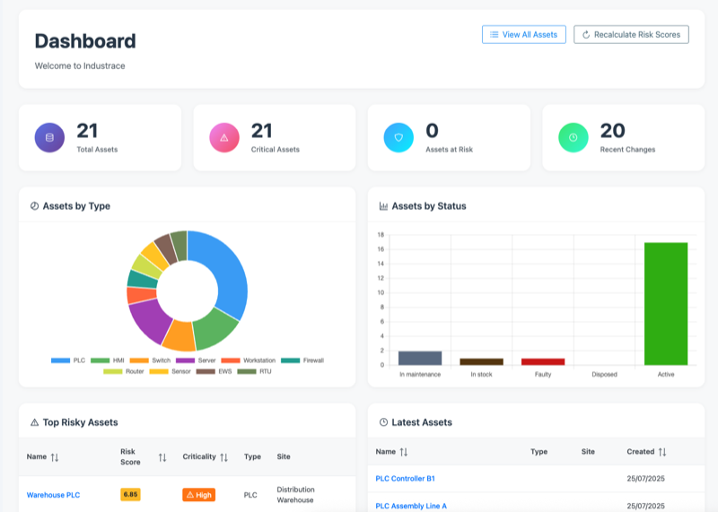
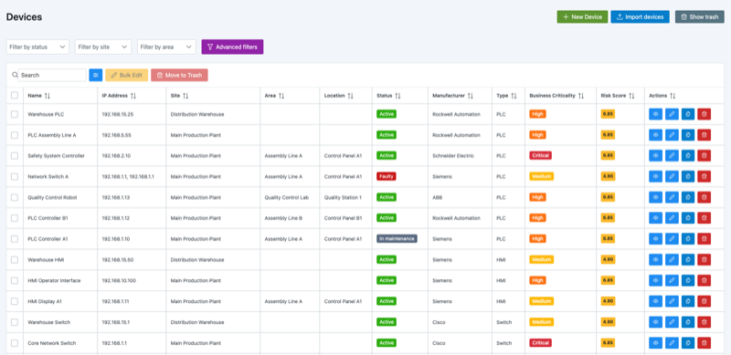
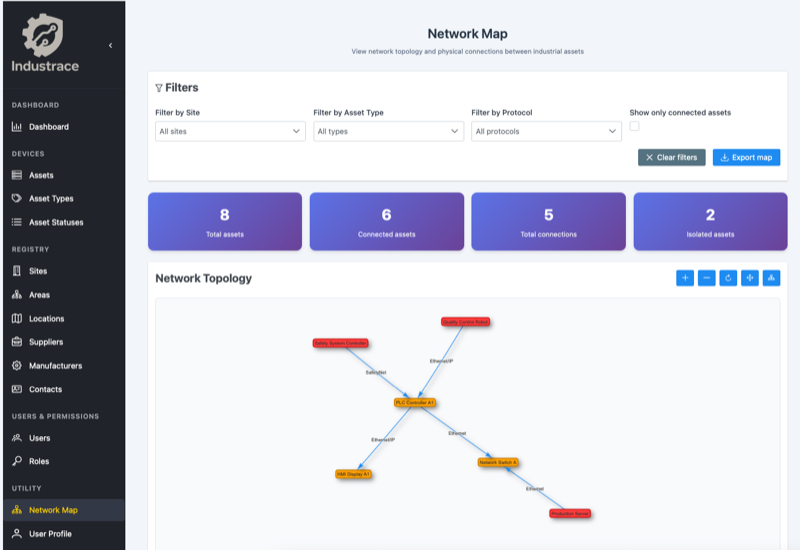
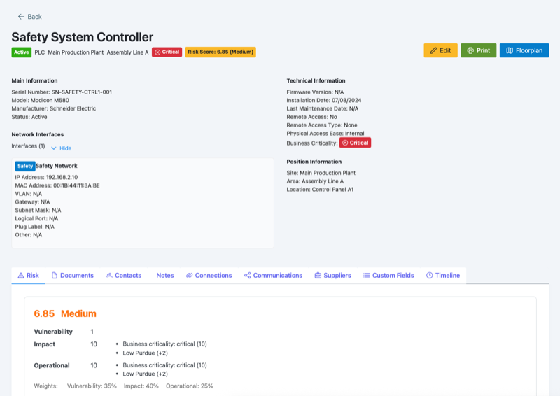
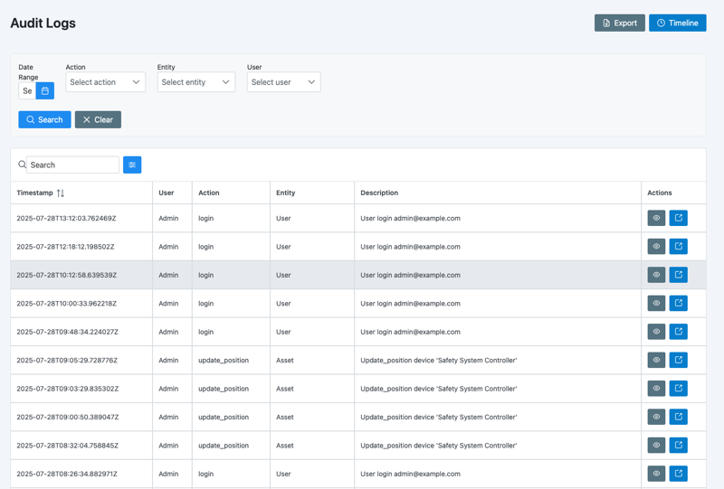
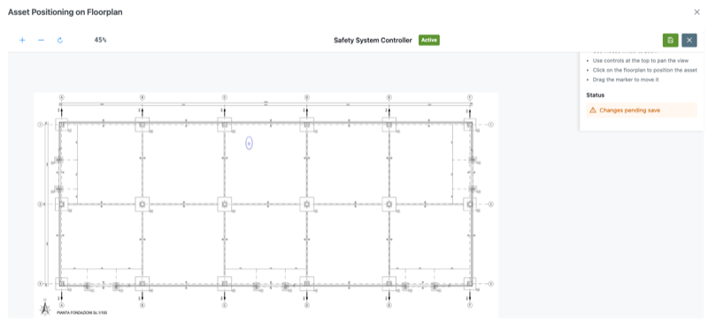
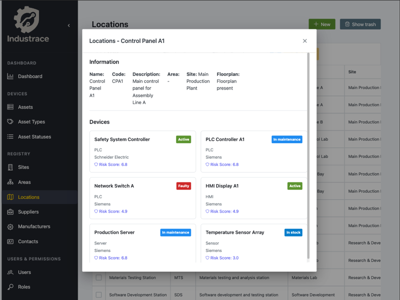

# Industrace - Industrial Asset Management System

[](https://opensource.org/licenses/AGPL-3.0)
[](https://www.docker.com/)
[](https://fastapi.tiangolo.com/)
[](https://vuejs.org/)

**Industrace** is a comprehensive Industrial Asset Management System designed for managing and monitoring industrial equipment, networks, and infrastructure. Built with FastAPI backend and Vue.js frontend, it provides a modern, scalable solution for industrial environments.

[](https://github.com/industrace/industrace/releases/tag/v1.0.0)

## 🌟 Key Features

- **Asset Management**: Complete lifecycle management of industrial assets
- **Network Mapping**: Visual representation of asset connections and communications
- **Risk Assessment**: Built-in risk scoring and vulnerability assessment
- **Multi-tenant Architecture**: Support for multiple organizations
- **Role-based Access Control**: Granular permissions system
- **Real-time Monitoring**: Live asset status and health monitoring
- **Document Management**: Asset documentation and photo management
- **Audit Trail**: Complete activity logging and change tracking
- **API-First Design**: RESTful API for integration with other systems
- **Modern UI**: Responsive Vue.js frontend with intuitive interface

## 📸 Screenshots & Demo

### 🏠 Dashboard Overview

*Main dashboard showing asset overview, risk scores, and system status*

### 📊 Asset Management

*Complete asset lifecycle management with detailed information and connections*

### 🌐 Network Topology

*Interactive network visualization showing asset connections and communications*

### 🔍 Asset Details

*Detailed asset view with interfaces, connections, and documentation*

### 👥 User Management

*Role-based access control with granular permissions management*

### 📋 Audit Trail

*Complete activity logging and change tracking for compliance*

### 🗺️ Floor Plan Integration

*Visual asset placement on floor plans with interactive mapping*

### 📱 Responsive Design

*Fully responsive interface that works on desktop, tablet, and mobile*

## 🏗️ Architecture

- **Backend**: FastAPI with SQLAlchemy ORM
- **Database**: PostgreSQL 15+
- **Frontend**: Vue.js 3 with Vite
- **Authentication**: JWT-based with role-based access control
- **Containerization**: Docker and Docker Compose
- **API Documentation**: Auto-generated with OpenAPI/Swagger

## 🚀 Quick Start

**Quick Start?** Go to [Quick Start Guide](docs/QUICK_START.md) for a quick installation **in less than 5 minutes**.

### Prerequisites
- Docker and Docker Compose
- 4GB RAM minimum (8GB recommended)
- 20GB disk space minimum

### Installation

#### Option 1: Automatic Initialization (Recommended)
```bash
# Clone the repository
git clone https://github.com/industrace/industrace.git
cd industrace

# Initialize system with demo data
make init

# Access the application
open http://localhost:5173
```

#### Option 2: Manual Setup
```bash
# Clone the repository
git clone https://github.com/industrace/industrace.git
cd industrace

# Start the application
docker-compose up -d

# Access the application
open http://localhost:5173
```

### Development Environment
```bash
# Start development environment
make dev

# Add demo data to existing system
make demo

# Clean system completely
make clean

# Show available commands
make help
```

### Default Credentials
- **URL**: http://localhost:5173
- **Email**: admin@example.com
- **Password**: admin123

**Note**: Demo data is automatically populated in development environment. The system includes sample sites, areas, locations, manufacturers, suppliers, contacts, assets with interfaces, and network connections for testing purposes.

## 📊 Demo Data Included

The system comes pre-populated with comprehensive demo data:

- **3 Sites**: Main Production Plant, Research & Development Center, Distribution Warehouse
- **12 Areas**: Assembly Lines, Quality Control Lab, Control Room, Maintenance Bay, etc.
- **19 Locations**: Control Panels, Quality Stations, Maintenance Bays, etc.
- **8 Assets**: PLCs, HMIs, Robots, Switches, Sensors, Servers with realistic specifications
- **10 Interfaces**: Network interfaces with IP addresses, MAC addresses, and protocols
- **5 Connections**: Network topology showing asset communications
- **4 Manufacturers**: Siemens, Rockwell Automation, Schneider Electric, ABB
- **4 Suppliers** and **6 Contacts**: Complete supply chain information

## Documentation

Complete documentation is available in the [docs](docs/) directory:

- [Quick Start Guide](docs/QUICK_START.md) - Get up and running in 5 minutes
- [Installation Guide](docs/installation.md) - Detailed installation instructions
- [User Manual](docs/user-manual.md) - How to use the application
- [API Documentation](docs/api-documentation.md) - Complete API reference
- [Development Guide](docs/development.md) - Development setup and guidelines
- [Administration Guide](docs/administration.md) - System administration
- [Security Guide](docs/security.md) - Security best practices
- [Troubleshooting](docs/troubleshooting.md) - Common issues and solutions

## 🔧 Development

### Prerequisites
- Python 3.8+
- Node.js 16+
- Docker and Docker Compose

### Setup Development Environment
```bash
# Clone and setup
git clone https://github.com/industrace/industrace.git
cd industrace

# Start development environment
make dev

# Run tests
make test

# View logs
make logs
```

### Available Make Commands
```bash
make init      # Initialize system with demo data
make dev       # Start development environment
make prod      # Start production environment
make demo      # Add demo data to existing system
make clean     # Clean system completely
make test      # Run tests
make logs      # View logs
make stop      # Stop all services
make build     # Build containers
make rebuild   # Rebuild containers
make status    # Show service status
make shell     # Open backend shell
make migrate   # Run database migrations
make reset-db  # Reset database
make restart   # Restart services
make info      # Show system information
```

## 🤝 Contributing

We welcome contributions! Please see our [Contributing Guide](CONTRIBUTING.md) for details.

## 📄 License

This project is licensed under the **GNU Affero General Public License v3.0 (AGPL-3.0)**. This means you are free to use, modify, and distribute the software, but any modifications must also be released under the same license.

See the [LICENSE](LICENSE) file for details.

## 🆘 Support

- **Documentation**: [docs/](docs/)
- **Issues**: [GitHub Issues](https://github.com/industrace/industrace/issues)
- **Discussions**: [GitHub Discussions](https://github.com/industrace/industrace/discussions)

## 📋 Changelog

### [v1.0.0] - 2024-12-19
#### 🎉 Initial Release
- **Complete Asset Management System**: Full lifecycle management for industrial assets
- **Multi-tenant Architecture**: Support for multiple organizations with data isolation
- **Role-based Access Control**: Granular permissions system (Admin, Editor, Viewer)
- **Network Topology Visualization**: Interactive network mapping with asset connections
- **Risk Assessment Engine**: Advanced risk scoring algorithm for industrial assets
- **Document Management**: Upload and manage asset photos and documents
- **Audit Trail**: Complete activity logging and change tracking
- **Import/Export System**: Excel/CSV import with preview and validation
- **Print System**: Generate PDF reports with QR codes
- **PCAP Analysis**: Network traffic analysis and protocol detection
- **Floor Plan Integration**: Visual asset placement on floor plans
- **Responsive Design**: Works on desktop, tablet, and mobile
- **Internationalization**: Full Italian and English language support
- **RESTful API**: Complete API with OpenAPI documentation
- **Docker Support**: Easy deployment with Docker Compose

#### 🔧 Technical Features
- FastAPI backend with PostgreSQL database
- Vue.js 3 frontend with PrimeVue components
- JWT authentication with secure cookies
- Real-time dashboard with charts and metrics
- Comprehensive error handling and validation
- Automated testing framework
- Production-ready Docker configuration

## 🗺️ Roadmap

See our [Roadmap](docs/roadmap.md) for planned features and improvements.

## Author and Support

- **Author**: Maurizio Bertaboni
- **Company**: BeSafe S.r.l.
- **Website**: https://besafe.it
- **Industrace Site**: https://besafe.it/industrace
- **Contact**: industrace@besafe.it

---

**Industrace** - Industrial Asset Management Made Simple 